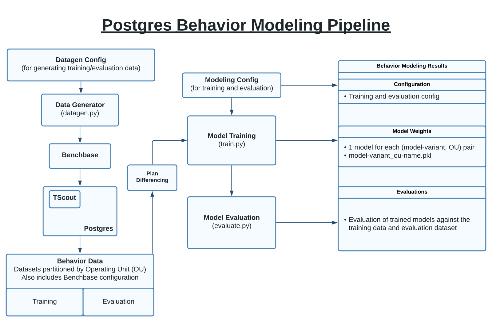

# Behavior Modeling

This document details the core components of behavior modeling and how to use them.

## Pipeline

This diagram details the general workflow.
TODO(GH): add plan differencing workflow to diagram.



## Postgres Plan Nodes

The following is a list of Postgres query plan nodes, each of which are profiled by TScout.

- Agg
- Append
- CteScan
- CustomScan
- ForeignScan
- FunctionScan
- Gather
- GatherMerge
- Group
- HashJoinImpl
- IncrementalSort
- IndexOnlyScan
- IndexScan
- Limit
- LockRows
- Material
- MergeAppend
- MergeJoin
- ModifyTable
- NamedTuplestoreScan
- NestLoop
- ProjectSet
- RecursiveUnion
- Result
- SampleScan
- SeqScan
- SetOp
- Sort
- SubPlan
- SubqueryScan
- TableFuncScan
- TidScan
- Unique
- ValuesScan
- WindowAgg
- WorkTableScan

## BenchBase Benchmark Databases

This list includes several BenchBase benchmarks that have been run through behavior modeling.  TODO(GH): denote which do/don't work with plan differencing.

- AuctionMark
- SmallBank
- TATP
- TPC-C - primary focus
- TPC-H - pending dataloader
- Twitter
- Voter
- Wikipedia
- YCSB

## Resource Consumption Metrics

The following is a list of resource consumption metrics that TScout collects and the operating unit models predict.

- cpu_cycles
- instructions
- cache_references
- cache_misses
- ref_cpu_cycles
- network_bytes_read
- network_bytes_written
- disk_bytes_read
- disk_bytes_written
- memory_bytes
- elapsed_us

## Operating Unit (OU) Model Variants

- lr - good baseline
- huber
- svr
- kr
- rf - good performance
- gbm - good performance
- mlp
- mt_lasso
- lasso
- dt
- mt_elastic
- elastic

## Training Data

- Separated into training and evaluation data in `noisepage-pilot/data/behavior/training_data/train` and `noisepage-pilot/data/behavior/training_data/eval`
- This is done because it makes data management simpler, and we can always easily add more training data.
- The alternative is to have the data stored jointly and maintain indexes or nested directories partitioning training and evaluation data.  This is typically only worth doing if training data is scarce and expensive because it allows for more flexible experimentation with minimal data.  This isn't a concern here, so we fully separate train and evaluation datasets.  This also avoids issues of intra-run data leakage; i.e. the data within a given round not being I.I.D.
- In the future, it may be best to store this data in a database because it is tabular and SQL-based access will allow for more flexible and dynamic construction of training/evaluation sets.  This was not a concern in MB2 because the data was statically created one time by handwritten microbenchmarks and all columns for all OUs were identical.

## Training (`train.py`)

Trains, evaluates, and serializes models, saving all results to `noisepage-pilot/data/behavior/models/${training_timestamp}/`

- Train.py accepts a training/evaluation configuration name.  These configurations are located in `noisepage-pilot/config/behavior/`.

## Inference (`inference.py`) (WIP)

Inference runs on unlabeled data and serializes results.
Wan and Garrison are working on the API for this.

## References

See [^mb2] for more details.

[^mb2]: MB2: Decomposed Behavior Modeling for Self-Driving Database Management Systems

    ```
    @article{ma21,
    author = {Ma, Lin and Zhang, William and Jiao, Jie and Wang, Wuwen and Butrovich, Matthew and Lim, Wan Shen and Menon, Prashanth and Pavlo, Andrew},
    title = {MB2: Decomposed Behavior Modeling for Self-Driving Database Management Systems},
    journal = {SIGMOD},
    year = {2021},
    url = {https://www.cs.cmu.edu/~malin199/publications/2021.mb2.sigmod.pdf},
    }
    ```
